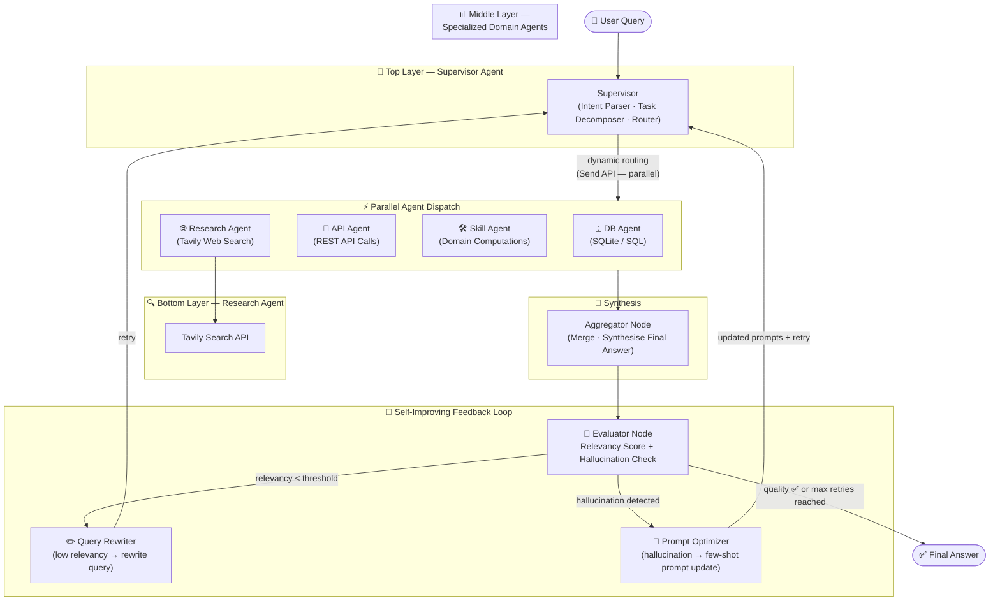

# Evo-Hierarch-RAG
**Hierarchical Agentic RAG with Self-Improving Loop** — 基于 LangGraph 的多层级自进化 Agentic RAG 系统

---

## 系统架构图（Mermaid）



---

## 模块说明

### 层级结构

| 层级 | 模块 | 职责 |
|------|------|------|
| **Top Layer** | `src/agents/supervisor.py` | 解析用户意图、评估查询复杂度、拆分任务、动态路由 |
| **Middle Layer** | `src/agents/db_agent.py` | LLM 生成 SQL → 查询结构化数据库（内置 SQLite Demo） |
| **Middle Layer** | `src/agents/api_agent.py` | LLM 选择 API 端点 → 调用企业私有接口（含 Mock） |
| **Middle Layer** | `src/agents/skill_agent.py` | 领域计算、文本分类、数学推导等特定技能 |
| **Bottom Layer** | `src/agents/research_agent.py` | Tavily 实时网络搜索 → LLM 综合答案 |
| **Synthesis** | `src/nodes/aggregator.py` | 汇总所有 Agent 结果，生成最终答案 |
| **Self-Improving** | `src/nodes/evaluator.py` | 相关性评分（0–1）+ 幻觉检测 |
| **Self-Improving** | `src/nodes/query_rewriter.py` | 低相关性时重写查询词 |
| **Self-Improving** | `src/nodes/prompt_optimizer.py` | 失败案例驱动的 Few-shot Prompt 优化 |

### 核心工作流

1. **动态路由**：Supervisor 分析 Query 属性（实时性/专业性/数据来源），决定激活哪些子 Agent。
2. **并行执行**：通过 LangGraph `Send` API 将多个子 Agent **并行**调度，结果通过 `Annotated[List, operator.add]` reducer 自动合并。
3. **状态管理**：`GraphState` TypedDict 贯穿所有节点，传递 Query、检索上下文、评分结果和中间变量。
4. **自进化闭环**：
   - 相关性低 → Query Rewriter 重写检索词 → 重新路由
   - 检测到幻觉 → Prompt Optimizer 更新 System Prompt → 重新路由
   - 超过最大重试次数 → 直接输出当前最优答案

---

## 项目结构

```
Evo-Hierarch-RAG/
├── main.py                    # 入口程序（CLI + 演示）
├── requirements.txt           # Python 依赖
├── .env.example               # 环境变量模板
├── src/
│   ├── config.py              # 集中配置（API Key、模型、阈值等）
│   ├── state.py               # LangGraph GraphState TypedDict 定义
│   ├── graph.py               # 完整 StateGraph 构建（含并行 Send 调度）
│   ├── agents/
│   │   ├── supervisor.py      # Top-Layer：任务分解 + 动态路由
│   │   ├── db_agent.py        # Middle-Layer：SQL 数据库查询
│   │   ├── api_agent.py       # Middle-Layer：REST API 调用
│   │   ├── skill_agent.py     # Middle-Layer：领域特定技能
│   │   └── research_agent.py  # Bottom-Layer：Tavily 实时网络搜索
│   └── nodes/
│       ├── aggregator.py      # 汇总结果，生成最终答案
│       ├── evaluator.py       # 相关性评分 + 幻觉检测 + 路由决策
│       ├── query_rewriter.py  # 查询重写（自进化组件 #1）
│       └── prompt_optimizer.py # Few-shot Prompt 优化（自进化组件 #2）
└── tests/
    └── test_graph.py          # 27 个单元测试（无需 API Key，全离线运行）
```

---

## 快速开始

### 1. 安装依赖

```bash
pip install -r requirements.txt
```

### 2. 配置环境变量

```bash
cp .env.example .env
# 编辑 .env，填入 OPENAI_API_KEY 和 TAVILY_API_KEY
```

### 3. 运行演示

```bash
# 使用内置演示查询（3 条）
python main.py

# 指定自定义查询
python main.py --query "最新的大语言模型研究进展有哪些？"
```

### 4. 运行测试

```bash
python -m pytest tests/ -v
```

---

## 扩展新 Middle-Layer Agent

1. 在 `src/agents/` 中新建 `my_agent.py`，实现 `my_agent_node(state: GraphState) -> Dict[str, Any]`。
2. 在 `src/config.py` 中添加 `AGENT_MY: str = "my_agent"` 并将其加入 `VALID_AGENTS`。
3. 在 `src/graph.py` 中：
   - `builder.add_node("my_agent", my_agent_node)`
   - 在 `_AGENT_NODE_MAP` 字典中添加 `"my_agent": "my_agent"`
   - `builder.add_edge("my_agent", "aggregator")`
4. Supervisor 会自动感知并路由到新 Agent。

---

## 技术栈

- **[LangGraph](https://github.com/langchain-ai/langgraph)** — 状态机图框架，支持并行 Send 调度和条件边
- **[LangChain](https://github.com/langchain-ai/langchain)** — LLM 集成（OpenAI GPT-4o-mini）
- **[Tavily](https://tavily.com)** — 实时网络搜索 API
- **Python 3.10+** — 标准库（sqlite3、json、typing）

